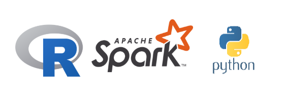

# Explorando R e Python com Spark no contexto da Estatística 

Este respositório contém o Minicurso 2 que foi ministrado na V EPBEst - V Encontro Paraibano de Estatística realizado em João Pessoa nas datas de 27.10.2025 e 28.10.2025.

LICENSE: Este repositório, assim como os códigos estão sob a licença MIT, pode ser lida [clicando aqui](https://github.com/Jodavid/Estudos-com-Spark---pyhton-e-R/blob/main/LICENSE);

README.md: É o arquivo que gera este conteúdo de documentação do repositório;

